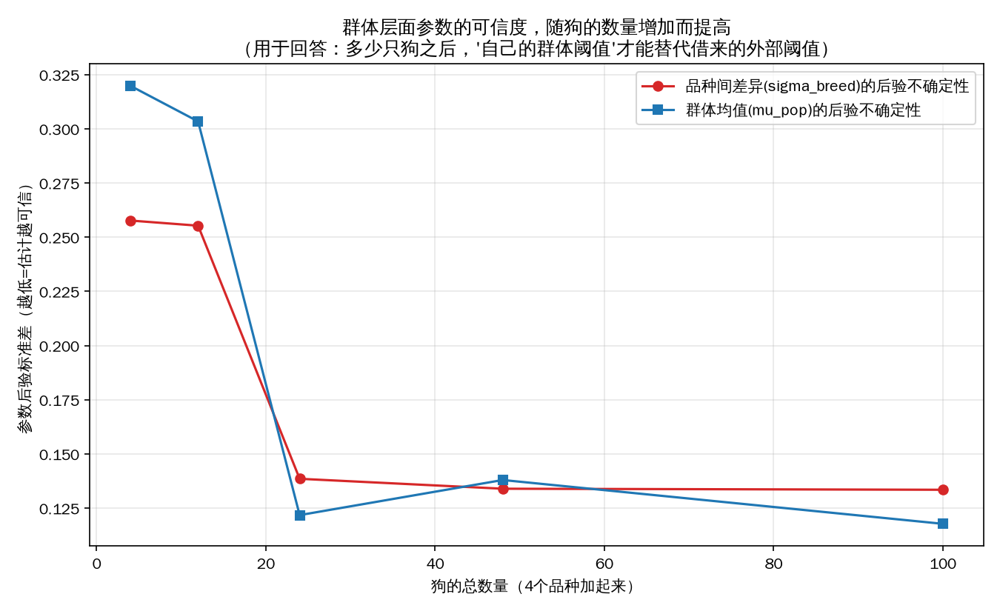
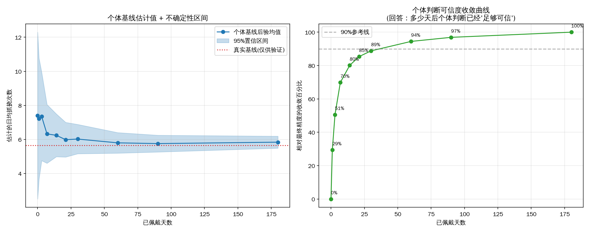

# 分层贝叶斯模型作为皮肤评估算法方案：业务问答

这份文档不重复讲模型的数学结构（那部分在 [`skin_health.md`](skin_health.md) §9/§10），只回答几个具体的产品/工程部署问题，配图表。图是用 [`business_scenario_plots.py`](../code/business_scenario_plots.py) 在合成数据上跑出来的，**用来说明"机制的形状"，不是最终产品要用的确切数字**——真实数字必须等真实数据来定，这份文档里给的天数/只数都是"大致量级参考"，不是写死的规格。

> 图表用的是较少的采样步数（500 draws/500 tune/2 chains，为了几组实验能在合理时间内跑完），跑的时候有 `r_hat>1.01` 的收敛警告——这是为了出图速度牺牲的精度，不影响这里要说明的"趋势形状"，但如果以后要拿具体数字定产品参数，要用完整的采样设置（`bhm_scratch_count.py` 默认的 1000/1000/4 chains）重新跑，不能直接抄这份文档图上的数字。

---

## 问题1：狗戴上多少天可以开始评估？阈值用什么、从哪来、怎么变？

拆成几个子问题分别答。

### 3天行不行？准不准？

**行，但"行"的意思是"能给出一个有依据的估计"，不是"估计很准"。** 贝叶斯模型不需要一个"够了才能用"的硬性天数门槛——从第1天起就能给出判断，只是数据越少，判断就越依赖"群体先验"、给出的不确定性区间越宽，模型会诚实地告诉你"现在还不太确定"，而不是拒绝给出任何结果。这跟我们现有SBS规则系统"21天前完全没有个体判断、21天后完全切换"的硬边界不一样。

具体多不准，看下面第2个问题的图。结论先说：3天大概只收敛到"最终精度"的**51%**左右。

### 阈值用时长还是次数？

**两个都该用，不是二选一。** 这次示范的 `bhm_scratch_count.py` 为了讲解方便，只对"每日抓挠次数"建了模，但时长完全可以用类似的方式单独建模（比如用对数正态或Gamma分布），或者把两者都当特征一起放进模型（类似 [`feature_catalog.md`](feature_catalog.md) 列的那些维度）。现有的PM文档规则系统（SBS）本来就是"次数、时长双门槛"同时判断，贝叶斯这条路线没有理由退化成只看一个维度，只是验证阶段先拿一个维度把机制跑通，图省事。

### 阈值是临床文献写死的，还是群体动态学出来的？

**两个阶段自然衔接，不是"选一个"，是贝叶斯更新本身就会把两者按权重融合。**

- **现在（群体样本几乎没有）**：阈值主要来自外部文献（Whistle FIT 已发表的分级阈值），相当于"借用行业经验"当先验起点
- **以后（自己的客群狗越来越多）**：阈值逐渐由我们自己狗群体的真实数据决定——不是某天"手动切换"到自己的数据，是贝叶斯更新本身会随着自己的数据积累，自动、连续地把权重从"外部先验"转移到"自己的数据"

这个"融合"过程可以直接算出来，见下面**图C**——不是猜的。

### 群体阈值要多少只狗才可信？多久更新一次？

用 `business_scenario_plots.py` 的**图A**回答：拿4个品种（金毛/中华田园犬/比熊/马尔济斯）分别在总狗数 4/12/24/48/100 只的规模下拟合模型，看"品种间差异"和"群体均值"这两个关键参数的后验不确定性怎么随狗的数量变化。

**结果**：不确定性在**总狗数24只左右（每品种约6只）出现明显下降拐点**，48只之后曲线基本走平——继续加狗，群体层面的判断不会再有多大提升。这给了一个具体的量级参考：**群体阈值这件事，不需要等到成百上千只狗才能开始信；每个品种攒到5~10只左右，群体层面的估计就已经比较像样了**，之后收益递减。

**更新频率**：不建议按固定日历周期（"1年""半年"）——这个思路本身跟贝叶斯模型的性质不匹配。更合理的设计，见图C揭示的规律：

- **早期（每个品种狗还很少）**：每新增几只狗、每积累一段真实数据，群体估计变化都比较大，这时候应该**更新得勤**（比如新增一批狗审核过数据质量后就重新拟合一次，不用等固定周期）
- **后期（每个品种已经有几十只狗）**：单只新狗、单批新数据对群体估计的边际影响很小（图A右侧曲线走平就是这个意思），这时候**可以降低更新频率**（比如按月，或者干脆按"新增狗数量超过某个比例才触发"这种数据量触发式的规则，而不是日历周期）

**"数据量够了就更新"这个想法基本对，但更准确的说法是"用真实统计规律去决定什么时候更新收益最大"，不是拍一个固定数字（比如"10只狗10天"）就当规则用一辈子**——图A本身就是回答"这个规律长什么样"的工具，等真实狗的数量上来后，应该重新拿真实数据跑一遍类似的曲线，用曲线的拐点位置决定更新节奏，而不是套用这次合成数据算出来的"24只"这个具体数字（那是这次特定合成参数下的结果，不是普适常数）。

---

## 问题2：多少天算"数据多了"，可以主要用个体判断？

用**图B**直接回答——单只新狗，从第0天到第180天，看模型给出的"个体基线"估计精度怎么随天数收敛：

具体数字（右图"收敛百分比"，100%代表跟180天时的精度一样好）：

| 佩戴天数 | 收敛度 | 说明 |
|---|---|---|
| 0天 | 0% | 完全靠群体先验 |
| 1天 | 29% | |
| 3天 | 51% | |
| 7天 | 70% | |
| 14天 | 80% | |
| **21天** | **85%** | **现有SBS规则系统用的门槛，落在这个位置** |
| 30天 | 89% | |
| 60天 | 95% | |
| 90天 | 97% | |
| 180天 | 100%（定义上） | |

**几个直接可用的结论**：

1. **收敛曲线是"前快后慢"的**——前7天涨得最快（0→70%），后面越来越平缓，这符合贝叶斯更新的一般规律（每条新数据带来的边际信息量递减）
2. **现有SBS用的21天门槛，落在85%这个位置，不算差**——比21天再等更久（比如30天），只多换来4个百分点（85%→89%），性价比不高；这说明21天这个之前拍的经验值，虽然不是拟合出来的，但**大致落在"收益开始明显放缓"的合理区间**，不需要因为这次分析就大改
3. **"越快越准"这个产品目标本身有内在矛盾，做不到两者都最优，只能选一个权衡点**——想要"快"，7天（70%）就能给出一个大致可用的初步判断；想要"准"，怎么也得30天以上。这不是算法能单方面替产品做的决定，需要产品明确"能接受多大的不确定性换多快出结果"

**具体建议**：不要在"个体判断"和"没有判断"之间做非黑即白的切换（现在SBS的21天硬边界就是这种设计），而是学 `bootstrap_mode` 这个字段的思路——**全程都给结果，但同时展示"现在的判断有多大把握"**（比如7天时展示"初步判断，数据仍在积累中"，30天后展示"判断已经比较稳定"）。这样产品体验上"越快"和"越准"不是对立的，是**同一条曲线上的不同位置，让用户自己感知置信度在提升**，而不是等一个固定天数才"解锁"判断。

---

## 问题3：现在影棚4只狗，能不能就用这4只狗+合成数据现在开展？要等3天还是7天？

**可以现在就开展，不需要等固定的天数，这个已经在做了。**

`validate_bhm_scratch_count.py` 现在跑的合成数据验证，用的就是我们影棚实际的4个品种（金毛/中华田园犬/比熊/马尔济斯），每个品种额外配了几只"合成陪跑狗"凑够验证机制本身用的样本规模——这不是将来要做的事，是已经在跑的东西。

**关于"要不要等3天/7天"这个问题，建议换个问法**：不是"等够N天再开始"，而是**"现在就把真实狗每天的真实抓挠次数接进模型（哪怕只有1天），随时间自然累积"**——因为：

1. 贝叶斯机制本身第1天就能给出结果（只是不确定性大，参考问题2的图B），不需要凑够一个天数才"解锁"
2. 我们要验证的是两件不同的事，不要混在一起要求：
   - **"这套贝叶斯机制本身对不对"**——这件事**已经用合成数据验证完了**（§9/§10的收敛诊断、部分池化方向、冷启动行为、异常检测效果都通过了），不需要等更多真实天数才能验证机制本身
   - **"真实狗的真实预测准不准"**——这件事必须要真实数据+时间积累，没有捷径，等多久取决于问题2的收敛曲线，不是"算法工程这边卡住了"，是数理规律决定的

所以"算法工程这边没有时间，只是验证阶段"这个顾虑，实际上不影响什么——**机制验证阶段本来就该用合成数据、追求快，已经做完了**；真实数据的积累是另一条独立的时间线，从现在开始接入真实每日计数，让它自然累积，不需要为了凑够"7天"这种整数天数而人为拖延，也不需要因为只有1-2天数据就觉得"还不能用"——参考图B，1天就有29%的收敛度，比0天（完全靠先验）已经好不少，接入越早，积累越快。

---

## 小结：给产品侧的三句话总结

1. **阈值不是选"临床文献"还是"群体动态学习"，是两者按数据量自动加权融合**——现在数据少，主要靠外部经验；以后自己的狗多了，自动过渡到主要靠自己的数据，这个过渡是连续的，不是某天手动切换
2. **群体规模到"每品种5~10只"左右开始明显有意义，24只左右见到收益放缓的拐点**（这次合成数据给出的量级，真实数据到手后要重新验证这个具体数字）；**个体判断30天左右收敛到89%，21天（现有设计）已经到85%，性价比曲线在这附近变平**
3. **现在就该开始接真实数据，不用等一个固定天数**——机制已经用合成数据验证完，真实预测精度的提升是自然发生的，越早接入真实数据，积累得越快，没有"准备好了再开始"这一说
