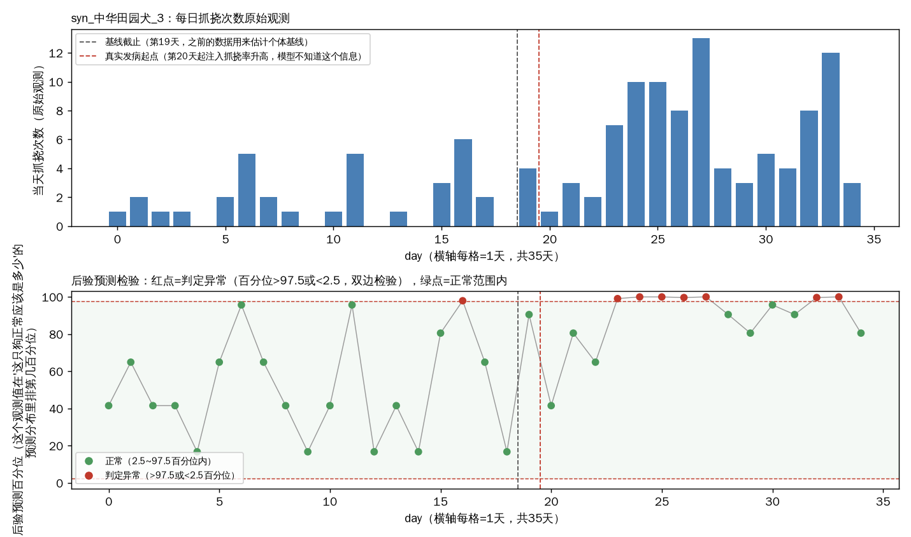

# 贝叶斯分层模型（BHM）验证画廊

> 对应 `bhm_scratch_count.py`（品种→狗→每日三层贝叶斯计数模型）和 `validate_bhm_scratch_count.py`（合成数据验证脚本），用的是影棚实际4个品种（金毛/中华田园犬/比熊/马尔济斯），每个品种额外配9只合成'陪跑'狗凑够能验证'借力'机制的样本规模（现实里每个品种只有1只真狗，组内方差没法估）。这份文档跟`scenario_gallery.md`（SBS规则引擎那份画廊）是同一个思路，但验证的是贝叶斯分层模型这条路，不是SBS打分公式那条路，两个是互补关系，不是替代关系（具体什么时候该上哪个，见`model_roadmap.md`）。

本次拟合收敛诊断：最大r_hat=1.000（越接近1.0越好，一般<1.01算收敛），发散样本数=0（越接近0越好）。

## 1. 部分池化（partial pooling）——数据量少的狗，估计值会更靠近品种基线

同一个品种（金毛）里挑4只基线期观测天数一样但原始均值不同的狗，对比"只看这只狗自己数据算出来的均值"（灰柱）和"模型综合了同品种其他狗信息后的估计值"（蓝柱）。原始均值离品种平均水平越远的狗，蓝柱被往品种基线拉回得越明显——这就是分层模型的核心机制：既不完全相信单只狗的少量数据（容易被噪声带偏），也不完全无视个体差异（不会把所有狗都拉成同一个数）。

| 狗 | 基线期观测天数 | 原始均值 | BHM后验估计 |
|---|---|---|---|
| real_金毛_0 | 19 | 2.79 | 3.25 |
| syn_金毛_1 | 19 | 9.21 | 8.40 |
| syn_金毛_2 | 19 | 4.63 | 4.73 |
| syn_金毛_3 | 19 | 5.16 | 5.16 |

数据：[部分池化对比表](../data/bhm_validation/partial_pooling_comparison.csv) | [基线期训练数据](../data/bhm_validation/train_data_baseline_period.csv)

---

## 2. 异常检测——一只狗从某天起患病，后验预测检验能不能及时发现

合成的"患病狗"：**syn_中华田园犬_3**，第20天起注入抓挠率显著上升（约3倍），模型拟合时完全不知道这个信息，只用前19天数据估计这只狗的个体基线，之后每天拿实际观测值去跟"这只狗正常情况下应该是多少"的后验预测分布比对，算出百分位，超出[2.5, 97.5]区间就判定异常（双边检验）。

- 基线期(19天)误报: 1天，误报率5%（理论期望约5%，双边2.5%+2.5%）
- 发病期(15天)命中: 7天，命中率47%
- 发病后首次成功报警延迟: 3天

数据：[逐日百分位+异常判定](../data/bhm_validation/anomaly_detection_syn_中华田园犬_3.csv)

---

## 3. 冷启动——一只全新狗，不确定性怎么随佩戴天数收窄

模拟一只全新绑定设备的中华田园犬，用Gamma-Poisson共轭近似（不用每天重跑完整MCMC）看不确定性区间怎么从"只有品种先验、完全没见过这只狗的数据"逐步收窄到"有一定个体数据支撑"。第0天区间最宽（纯品种先验），随着天数增加区间逐渐收窄并向这只狗的真实基线靠拢。

| 佩戴天数 | 估计日均抓挠 | 95%区间下限 | 95%区间上限 | 区间宽度 |
|---|---|---|---|---|
| 0 | 3.20 | 1.18 | 5.22 | 4.04 |
| 1 | 4.15 | 2.15 | 6.14 | 3.99 |
| 3 | 4.60 | 2.88 | 6.31 | 3.43 |
| 7 | 4.96 | 3.58 | 6.34 | 2.76 |
| 14 | 4.68 | 3.65 | 5.71 | 2.06 |
| 21 | 4.73 | 3.86 | 5.60 | 1.74 |
| 30 | 4.68 | 3.95 | 5.42 | 1.48 |

该狗真实基线（仅供验证，模型未知）：4.74

数据：[冷启动逐checkpoint明细](../data/bhm_validation/cold_start_new_dog.csv)

---

完整合成数据：[全部品种全部狗35天数据](../data/bhm_validation/simulated_full_data.csv) | [狗-品种-是否患病对照表](../data/bhm_validation/dog_meta.csv)
