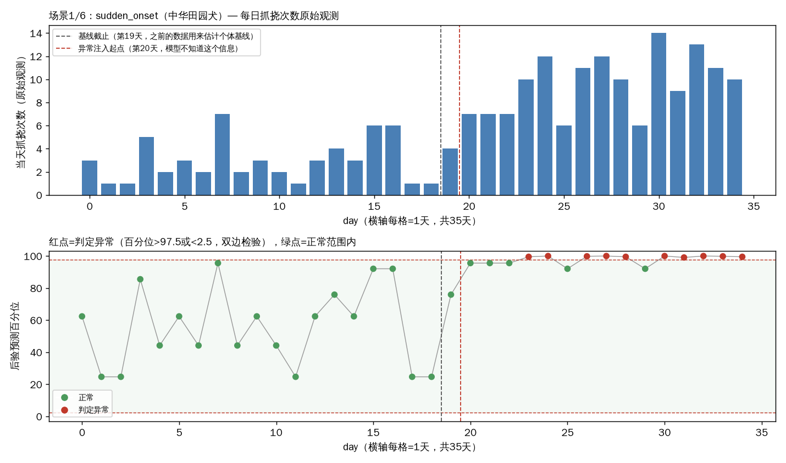
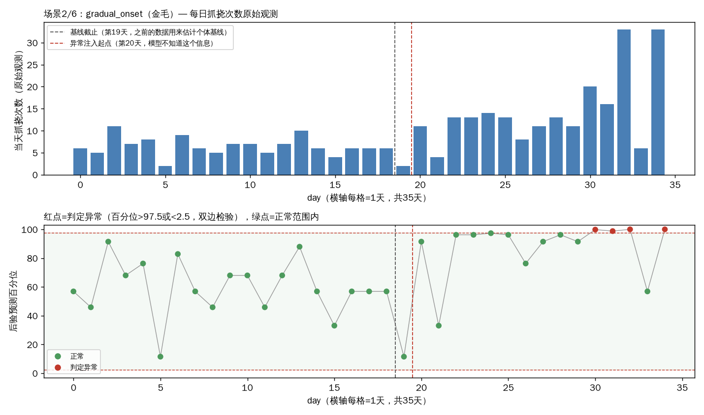
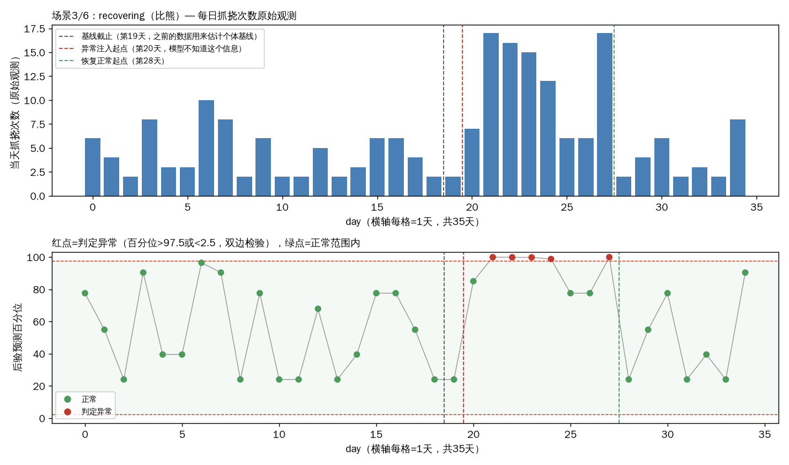
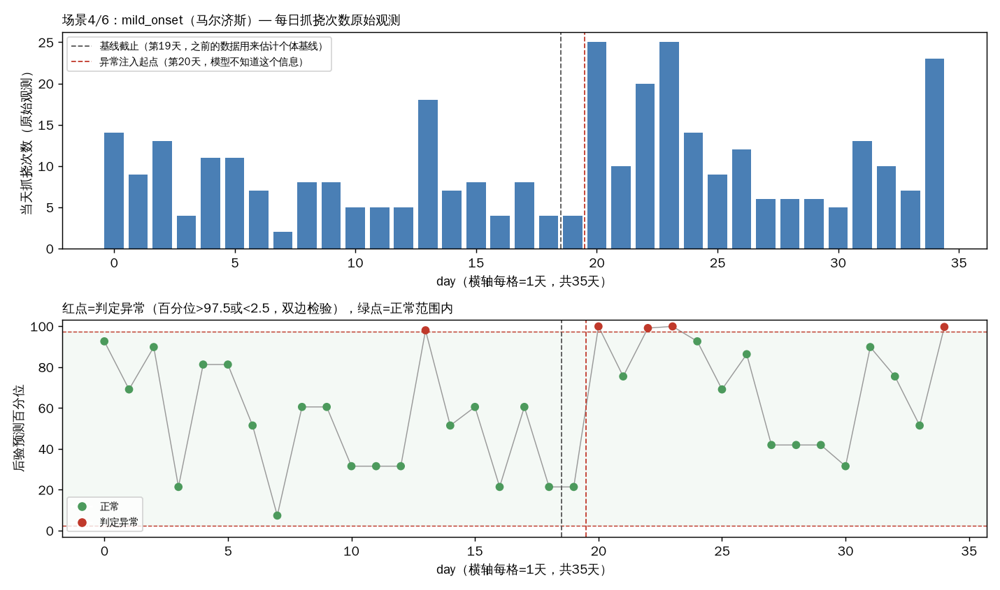
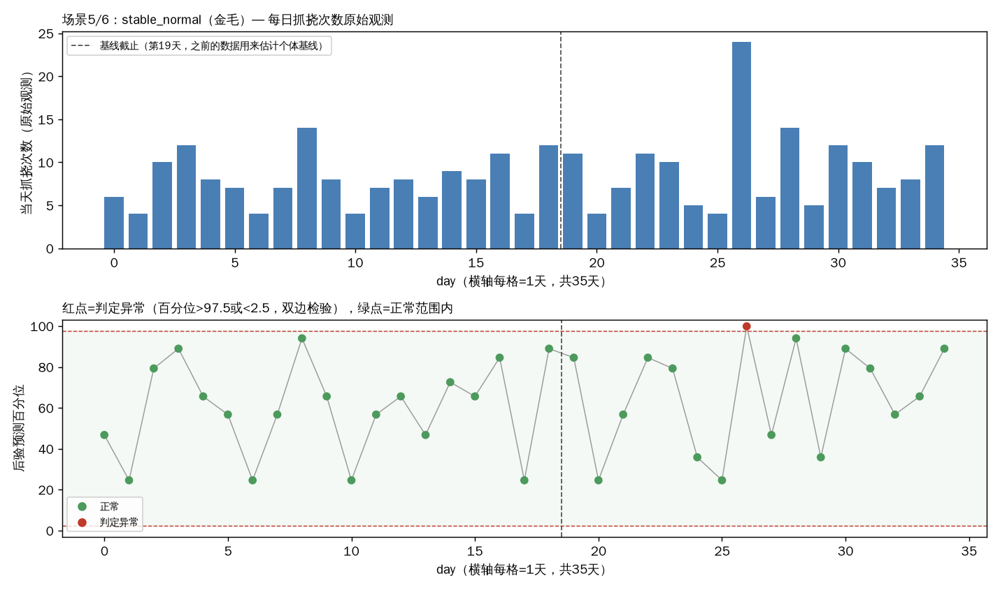
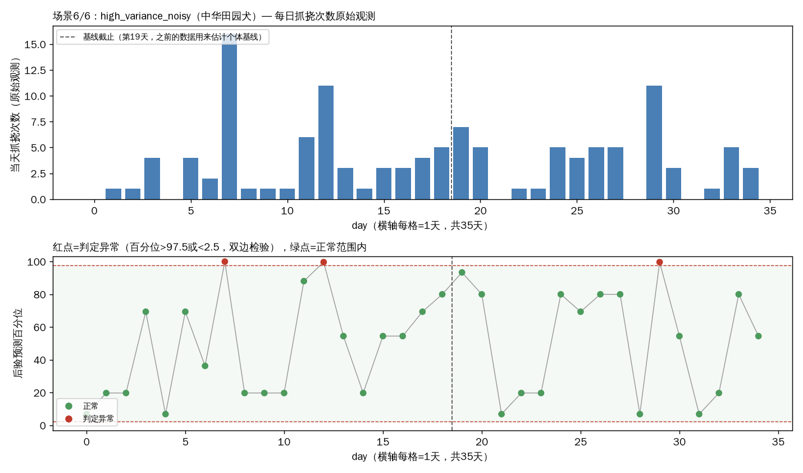
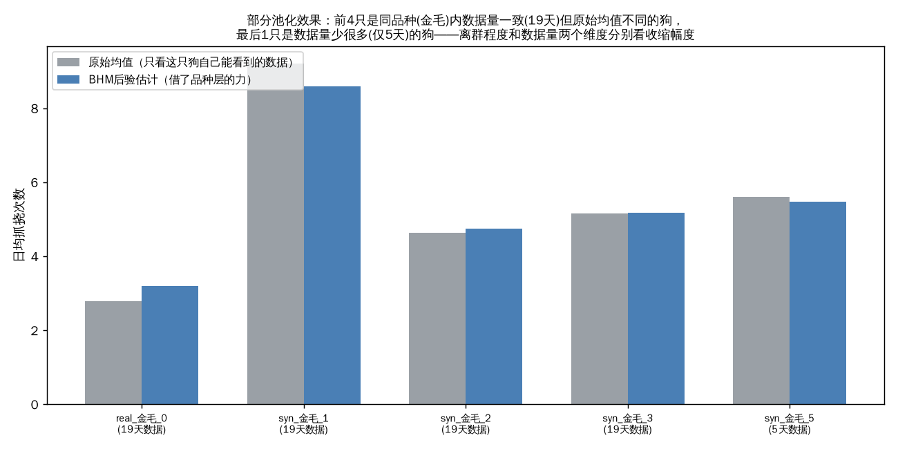
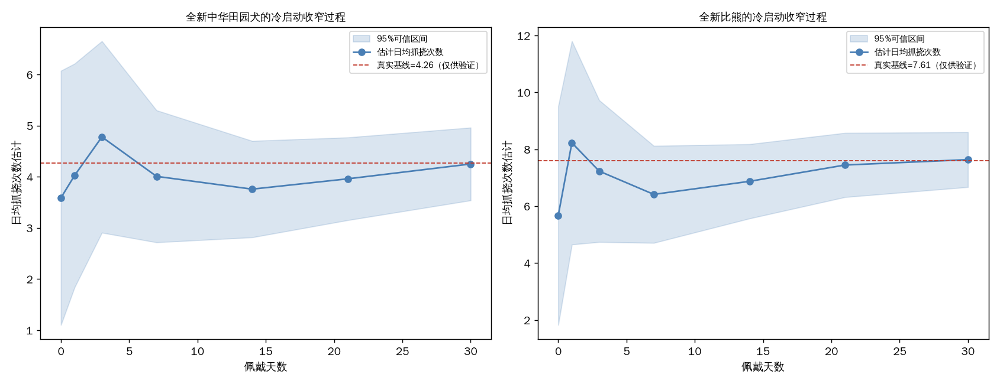

# 贝叶斯分层模型（BHM）验证画廊

> 对应 `bhm_scratch_count.py`（品种→狗→每日三层贝叶斯计数模型）+ `gen_bhm_scenarios.py`（场景定义）。跟`scenario_gallery.md`（SBS规则引擎那份画廊）是同一个思路，验证的是贝叶斯分层模型这条路，两者互补不是替代（什么时候该上哪个见`model_roadmap.md`）。

背景种群：4个品种（金毛/中华田园犬/比熊/马尔济斯），每个品种1只real_占位（对应影棚实际那4只狗） + 9只syn_陪跑（现实里每品种只有1只真狗，组内方差没法估，陪跑狗纯粹用于验证机制），再额外加6只场景狗，单次联合拟合一个模型，拟合完分别检验每只场景狗在自己的场景下表现如何。

本次拟合收敛诊断：最大r_hat=1.000（越接近1.0越好，一般<1.01算收敛），发散样本数=0（越接近0越好）。

## 场景总览

| # | 场景 | 品种 | 说明 |
|---|---|---|---|
| 1 | sudden_onset | 中华田园犬 | 第20天起阶跃式上升（约3倍），急性发作模式，验证检测延迟 |
| 2 | gradual_onset | 金毛 | 第20天起线性爬升到第32天到达约3倍水平，渐进恶化模式，验证模型会不会等爬到很高才反应过来，还是能在爬升途中就报警 |
| 3 | recovering | 比熊 | 第20-27天升高（约3倍）后第28天起恢复正常，验证异常信号会不会跟着恢复消退，而不是一直挂着报警 |
| 4 | mild_onset | 马尔济斯 | 第20天起小幅上升（约1.5倍，远轻于sudden_onset的3倍），对比检测延迟/命中率随异常幅度变化——异常越轻微，本来就应该越难/越慢发现 |
| 5 | stable_normal | 金毛 | 全程正常，不注入任何异常，验证35天里误报率是否符合双边检验约5%的理论期望（真阴性对照） |
| 6 | high_variance_noisy | 中华田园犬 | 均值水平跟同品种正常狗一样，但这只狗自己数据的离散度大得多（模型的alpha是全局共享参数，没法单独识别这只狗天生噪声更大），验证天然噪声大的狗会不会被误判成异常——这是在暴露模型的一个已知局限，不是要证明模型没问题 |

---

## 场景1/6：sudden_onset（中华田园犬）

**说明**：第20天起阶跃式上升（约3倍），急性发作模式，验证检测延迟

- 基线期(19天)误报: 0天 误报率0%（理论期望约5%，双边2.5%+2.5%）
- 异常期(15天)命中: 10天 命中率67%
- 首次成功报警延迟: 3天

数据：[逐日百分位+异常判定](../data/bhm_validation/scenario_sudden_onset.csv)

---

## 场景2/6：gradual_onset（金毛）

**说明**：第20天起线性爬升到第32天到达约3倍水平，渐进恶化模式，验证模型会不会等爬到很高才反应过来，还是能在爬升途中就报警

- 基线期(19天)误报: 0天 误报率0%（理论期望约5%，双边2.5%+2.5%）
- 异常期(15天)命中: 4天 命中率27%
- 首次成功报警延迟: 10天

数据：[逐日百分位+异常判定](../data/bhm_validation/scenario_gradual_onset.csv)

---

## 场景3/6：recovering（比熊）

**说明**：第20-27天升高（约3倍）后第28天起恢复正常，验证异常信号会不会跟着恢复消退，而不是一直挂着报警

- 基线期(19天)误报: 0天 误报率0%（理论期望约5%，双边2.5%+2.5%）
- 异常期(15天)命中: 5天 命中率33%
- 首次成功报警延迟: 1天

数据：[逐日百分位+异常判定](../data/bhm_validation/scenario_recovering.csv)

---

## 场景4/6：mild_onset（马尔济斯）

**说明**：第20天起小幅上升（约1.5倍，远轻于sudden_onset的3倍），对比检测延迟/命中率随异常幅度变化——异常越轻微，本来就应该越难/越慢发现

- 基线期(19天)误报: 1天 误报率5%（理论期望约5%，双边2.5%+2.5%）
- 异常期(15天)命中: 4天 命中率27%
- 首次成功报警延迟: 0天

数据：[逐日百分位+异常判定](../data/bhm_validation/scenario_mild_onset.csv)

---

## 场景5/6：stable_normal（金毛）

**说明**：全程正常，不注入任何异常，验证35天里误报率是否符合双边检验约5%的理论期望（真阴性对照）

- 基线期(19天)误报: 0天 误报率0%（理论期望约5%，双边2.5%+2.5%）
- 全程未注入异常，此项为真阴性对照，只看基线期误报率是否符合理论期望

数据：[逐日百分位+异常判定](../data/bhm_validation/scenario_stable_normal.csv)

---

## 场景6/6：high_variance_noisy（中华田园犬）

**说明**：均值水平跟同品种正常狗一样，但这只狗自己数据的离散度大得多（模型的alpha是全局共享参数，没法单独识别这只狗天生噪声更大），验证天然噪声大的狗会不会被误判成异常——这是在暴露模型的一个已知局限，不是要证明模型没问题

- 基线期(19天)误报: 2天 误报率11%（理论期望约5%，双边2.5%+2.5%）
- 全程未注入异常，此项为真阴性对照，只看基线期误报率是否符合理论期望

数据：[逐日百分位+异常判定](../data/bhm_validation/scenario_high_variance_noisy.csv)

---

## 部分池化（partial pooling）——数据量少/原始值离群的狗，估计值怎么被拉回品种基线

前4只是同品种（金毛）内基线期数据量一致（19天）但原始均值不同的狗，最后1只（syn_金毛_5）是数据量少很多（只给模型看5天数据，模拟"刚绑设备没多久"）的狗——原始值离群程度和数据量两个维度分别看收缩幅度：离群越远/数据越少，蓝柱（模型估计）偏离灰柱（原始均值）越明显。

| 狗 | 训练时可见天数 | 原始均值 | BHM后验估计 |
|---|---|---|---|
| real_金毛_0 | 19 | 2.79 | 3.19 |
| syn_金毛_1 | 19 | 9.21 | 8.59 |
| syn_金毛_2 | 19 | 4.63 | 4.75 |
| syn_金毛_3 | 19 | 5.16 | 5.18 |
| syn_金毛_5 | 5 | 5.60 | 5.47 |

数据：[部分池化对比表](../data/bhm_validation/partial_pooling_comparison.csv) | [基线期训练数据](../data/bhm_validation/train_data_baseline_period.csv)

---

## 冷启动——两个品种对比，全新狗的不确定性怎么随佩戴天数收窄

同样用Gamma-Poisson共轭近似（不用每天重跑完整MCMC），对比两个方差/均值水平不同的品种（中华田园犬 vs 比熊），全新狗的95%可信区间从第0天（纯品种先验，最宽）到第30天怎么收窄——品种间基线/方差本身不同，收窄的绝对宽度和起点也会不一样，这是预期内的正常现象。

数据：[两品种逐checkpoint明细](../data/bhm_validation/cold_start_new_dog.csv)

---

完整合成数据：[全部品种全部狗35天数据](../data/bhm_validation/simulated_full_data.csv) | [狗-品种-场景对照表](../data/bhm_validation/dog_meta.csv)
