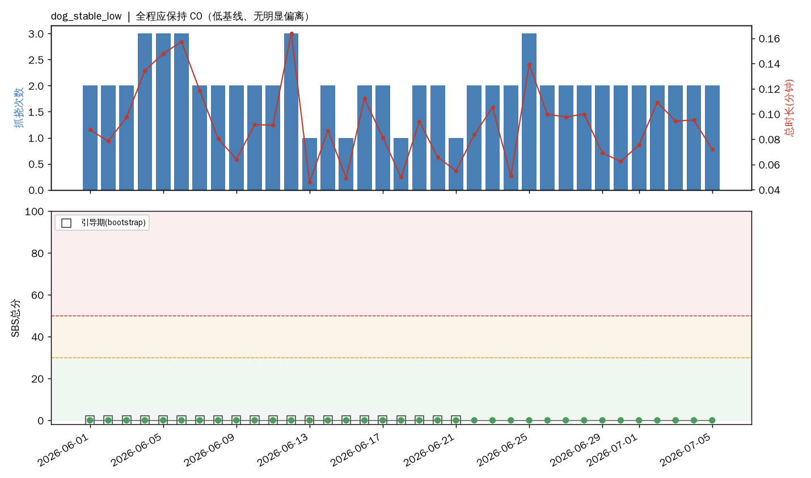
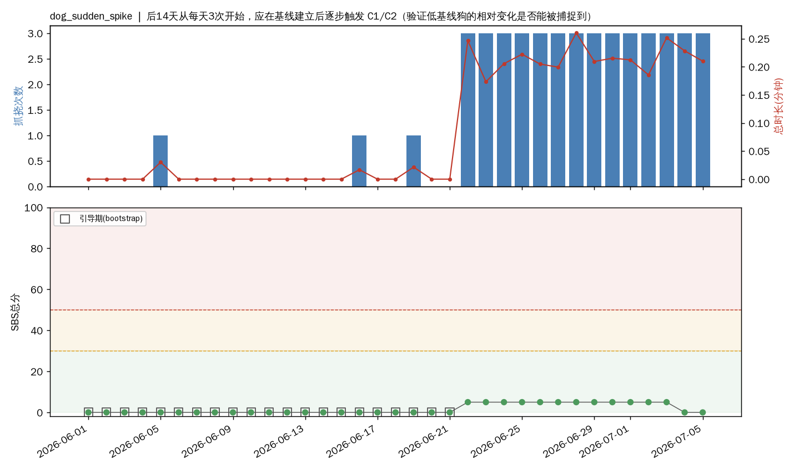
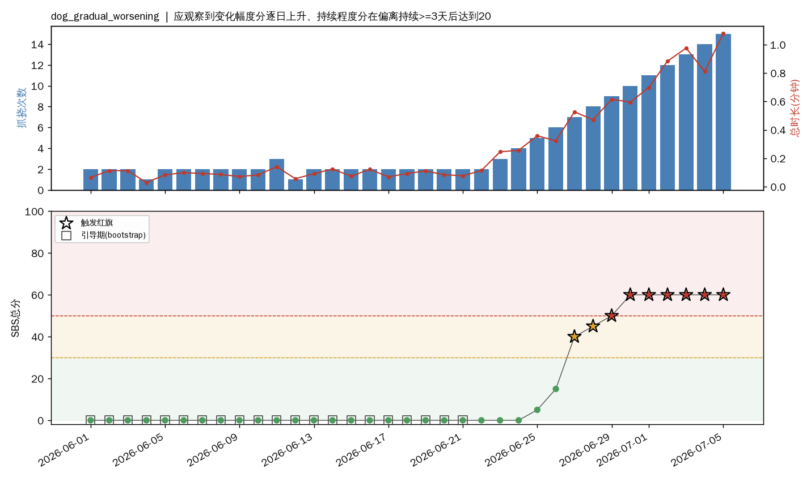
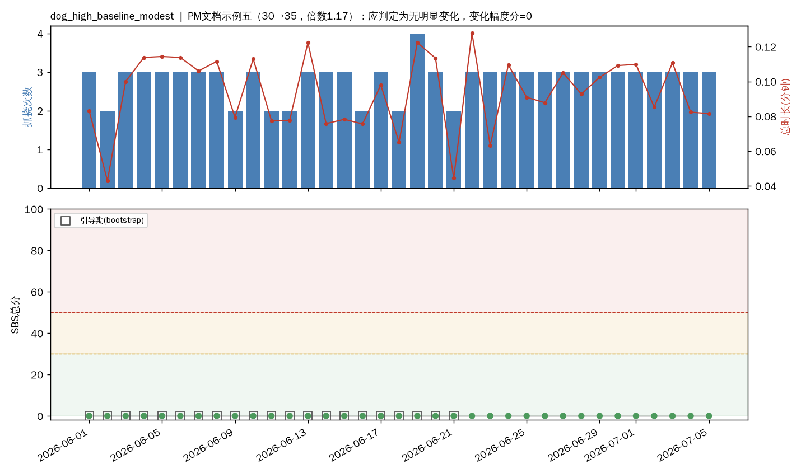
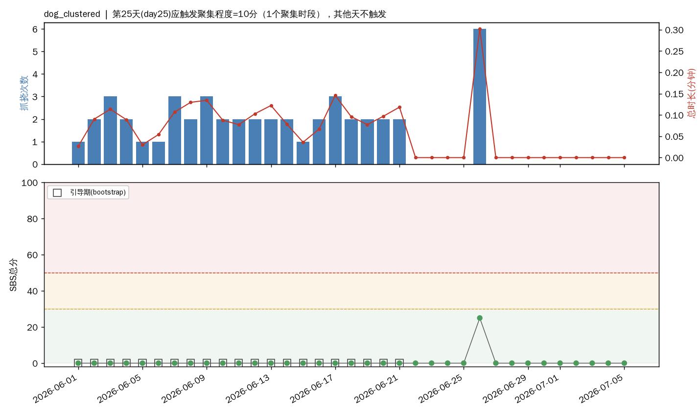
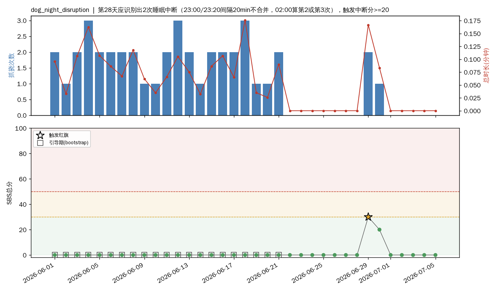
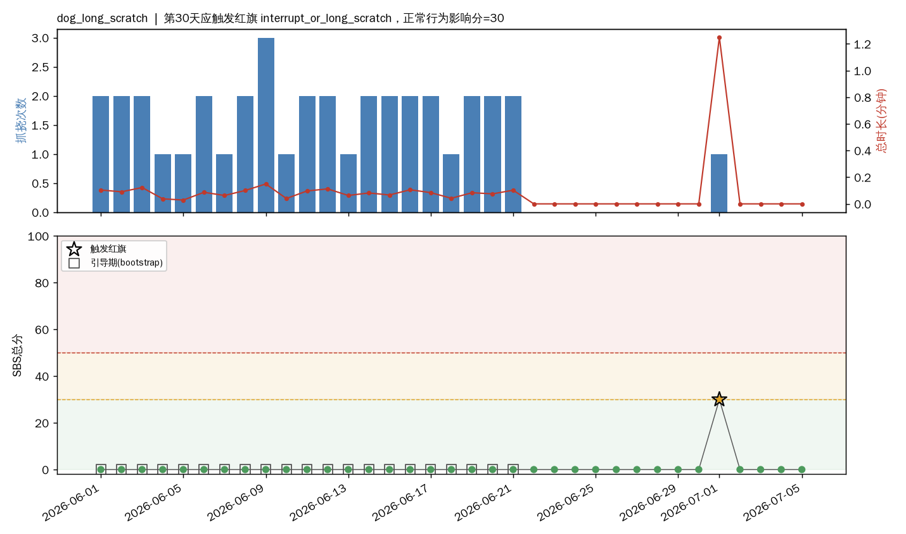
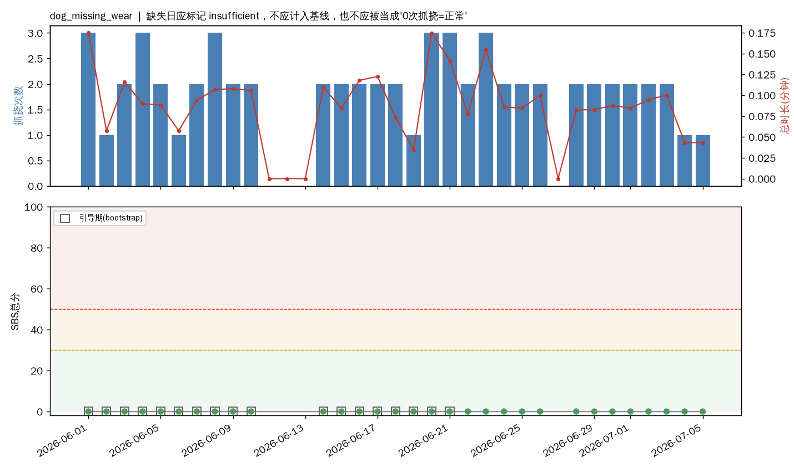
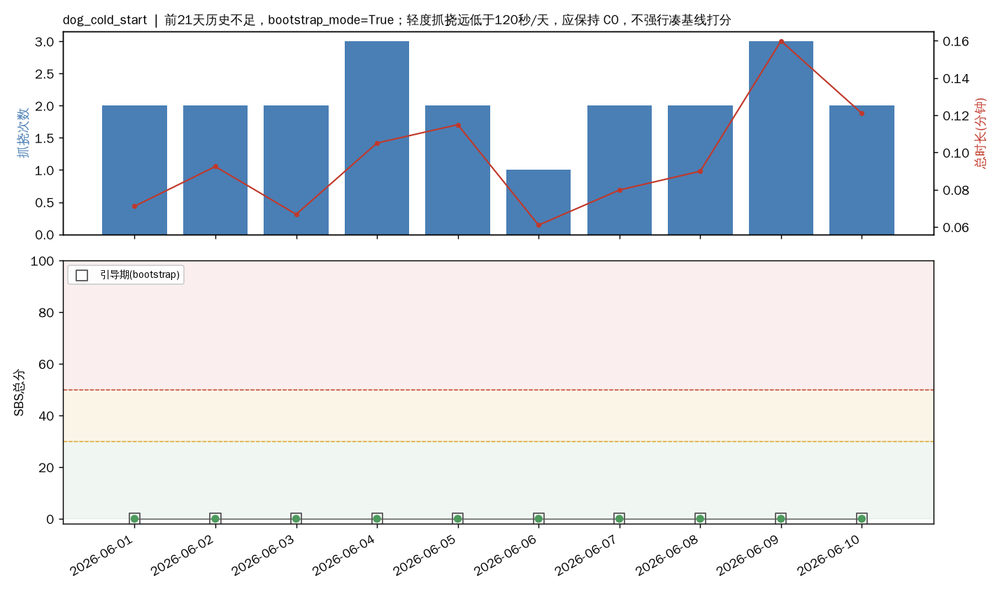
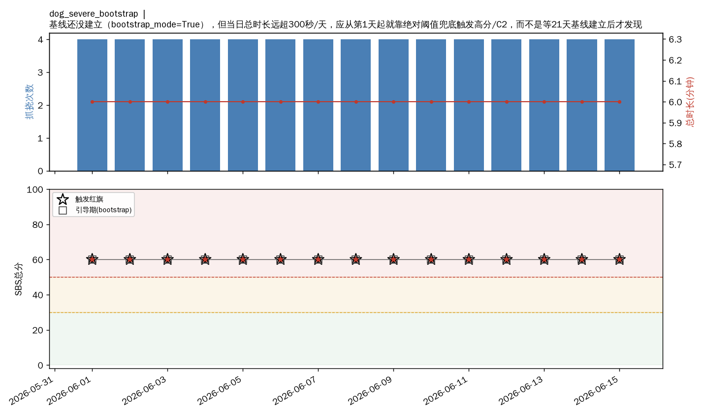

# 皮肤评级合成场景画廊

> 每个场景对应 `gen_synthetic_scratch_scenarios.py` 里的一个 `scenario_*` 函数，用来验证 SBS 打分机制（不是抓挠事件识别准确率）。这份文档配图+关键天数表格，不用跑代码就能直观看每个场景的抓挠情况和评分结果；完整逐天数据在对应的CSV里。

图例：上图蓝柱=每日抓挠次数，红线=每日总时长(分钟)；下图散点=SBS总分，背景绿/黄/红对应C0/C1/C2分档，黑色星号=当天触发红旗，空心方块=处于引导期(bootstrap_mode，历史不足21天，靠绝对阈值兜底评分)。

## dog_stable_low

**预期**：全程应保持 C0（低基线、无明显偏离）

关键天数（非C0 / 触发红旗 / 引导期，完整35天数据见CSV）：

| 日期 | 抓挠次数 | 总分 | 分档 | 红旗 | 引导期 |
|---|---|---|---|---|---|
| 2026-06-01 | 2 | 0 | C0 | - | 是 |
| 2026-06-02 | 2 | 0 | C0 | - | 是 |
| 2026-06-03 | 2 | 0 | C0 | - | 是 |
| 2026-06-04 | 3 | 0 | C0 | - | 是 |
| 2026-06-05 | 3 | 0 | C0 | - | 是 |
| 2026-06-06 | 3 | 0 | C0 | - | 是 |
| 2026-06-07 | 2 | 0 | C0 | - | 是 |
| 2026-06-08 | 2 | 0 | C0 | - | 是 |

原始数据：[抓挠事件明细](../data/synthetic_scenarios/dog_stable_low_events.csv) | [每日SBS结果](../data/synthetic_scenarios/dog_stable_low_daily_result.csv)

---

## dog_sudden_spike

**预期**：后14天从每天3次开始，应在基线建立后逐步触发 C1/C2（验证低基线狗的相对变化是否能被捕捉到）

关键天数（非C0 / 触发红旗 / 引导期，完整35天数据见CSV）：

| 日期 | 抓挠次数 | 总分 | 分档 | 红旗 | 引导期 |
|---|---|---|---|---|---|
| 2026-06-01 | 0 | 0 | C0 | - | 是 |
| 2026-06-02 | 0 | 0 | C0 | - | 是 |
| 2026-06-03 | 0 | 0 | C0 | - | 是 |
| 2026-06-04 | 0 | 0 | C0 | - | 是 |
| 2026-06-05 | 1 | 0 | C0 | - | 是 |
| 2026-06-06 | 0 | 0 | C0 | - | 是 |
| 2026-06-07 | 0 | 0 | C0 | - | 是 |
| 2026-06-08 | 0 | 0 | C0 | - | 是 |

原始数据：[抓挠事件明细](../data/synthetic_scenarios/dog_sudden_spike_events.csv) | [每日SBS结果](../data/synthetic_scenarios/dog_sudden_spike_daily_result.csv)

---

## dog_gradual_worsening

**预期**：应观察到变化幅度分逐日上升、持续程度分在偏离持续>=3天后达到20

关键天数（非C0 / 触发红旗 / 引导期，完整35天数据见CSV）：

| 日期 | 抓挠次数 | 总分 | 分档 | 红旗 | 引导期 |
|---|---|---|---|---|---|
| 2026-06-01 | 2 | 0 | C0 | - | 是 |
| 2026-06-02 | 2 | 0 | C0 | - | 是 |
| 2026-06-03 | 2 | 0 | C0 | - | 是 |
| 2026-06-04 | 1 | 0 | C0 | - | 是 |
| 2026-06-05 | 2 | 0 | C0 | - | 是 |
| 2026-06-06 | 2 | 0 | C0 | - | 是 |
| 2026-06-07 | 2 | 0 | C0 | - | 是 |
| 2026-06-08 | 2 | 0 | C0 | - | 是 |

原始数据：[抓挠事件明细](../data/synthetic_scenarios/dog_gradual_worsening_events.csv) | [每日SBS结果](../data/synthetic_scenarios/dog_gradual_worsening_daily_result.csv)

---

## dog_high_baseline_modest

**预期**：PM文档示例五（30→35，倍数1.17）：应判定为无明显变化，变化幅度分=0

关键天数（非C0 / 触发红旗 / 引导期，完整35天数据见CSV）：

| 日期 | 抓挠次数 | 总分 | 分档 | 红旗 | 引导期 |
|---|---|---|---|---|---|
| 2026-06-01 | 3 | 0 | C0 | - | 是 |
| 2026-06-02 | 2 | 0 | C0 | - | 是 |
| 2026-06-03 | 3 | 0 | C0 | - | 是 |
| 2026-06-04 | 3 | 0 | C0 | - | 是 |
| 2026-06-05 | 3 | 0 | C0 | - | 是 |
| 2026-06-06 | 3 | 0 | C0 | - | 是 |
| 2026-06-07 | 3 | 0 | C0 | - | 是 |
| 2026-06-08 | 3 | 0 | C0 | - | 是 |

原始数据：[抓挠事件明细](../data/synthetic_scenarios/dog_high_baseline_modest_events.csv) | [每日SBS结果](../data/synthetic_scenarios/dog_high_baseline_modest_daily_result.csv)

---

## dog_clustered

**预期**：第25天(day25)应触发聚集程度=10分（1个聚集时段），其他天不触发

关键天数（非C0 / 触发红旗 / 引导期，完整35天数据见CSV）：

| 日期 | 抓挠次数 | 总分 | 分档 | 红旗 | 引导期 |
|---|---|---|---|---|---|
| 2026-06-01 | 1 | 0 | C0 | - | 是 |
| 2026-06-02 | 2 | 0 | C0 | - | 是 |
| 2026-06-03 | 3 | 0 | C0 | - | 是 |
| 2026-06-04 | 2 | 0 | C0 | - | 是 |
| 2026-06-05 | 1 | 0 | C0 | - | 是 |
| 2026-06-06 | 1 | 0 | C0 | - | 是 |
| 2026-06-07 | 3 | 0 | C0 | - | 是 |
| 2026-06-08 | 2 | 0 | C0 | - | 是 |

原始数据：[抓挠事件明细](../data/synthetic_scenarios/dog_clustered_events.csv) | [每日SBS结果](../data/synthetic_scenarios/dog_clustered_daily_result.csv)

---

## dog_night_disruption

**预期**：第28天应识别出2次睡眠中断（23:00/23:20间隔20min不合并，02:00算第2或第3次），触发中断分>=20

关键天数（非C0 / 触发红旗 / 引导期，完整35天数据见CSV）：

| 日期 | 抓挠次数 | 总分 | 分档 | 红旗 | 引导期 |
|---|---|---|---|---|---|
| 2026-06-01 | 2 | 0 | C0 | - | 是 |
| 2026-06-02 | 1 | 0 | C0 | - | 是 |
| 2026-06-03 | 2 | 0 | C0 | - | 是 |
| 2026-06-04 | 3 | 0 | C0 | - | 是 |
| 2026-06-05 | 2 | 0 | C0 | - | 是 |
| 2026-06-06 | 2 | 0 | C0 | - | 是 |
| 2026-06-07 | 2 | 0 | C0 | - | 是 |
| 2026-06-08 | 2 | 0 | C0 | - | 是 |

原始数据：[抓挠事件明细](../data/synthetic_scenarios/dog_night_disruption_events.csv) | [每日SBS结果](../data/synthetic_scenarios/dog_night_disruption_daily_result.csv)

---

## dog_long_scratch

**预期**：第30天应触发红旗 interrupt_or_long_scratch，正常行为影响分=30

关键天数（非C0 / 触发红旗 / 引导期，完整35天数据见CSV）：

| 日期 | 抓挠次数 | 总分 | 分档 | 红旗 | 引导期 |
|---|---|---|---|---|---|
| 2026-06-01 | 2 | 0 | C0 | - | 是 |
| 2026-06-02 | 2 | 0 | C0 | - | 是 |
| 2026-06-03 | 2 | 0 | C0 | - | 是 |
| 2026-06-04 | 1 | 0 | C0 | - | 是 |
| 2026-06-05 | 1 | 0 | C0 | - | 是 |
| 2026-06-06 | 2 | 0 | C0 | - | 是 |
| 2026-06-07 | 1 | 0 | C0 | - | 是 |
| 2026-06-08 | 2 | 0 | C0 | - | 是 |

原始数据：[抓挠事件明细](../data/synthetic_scenarios/dog_long_scratch_events.csv) | [每日SBS结果](../data/synthetic_scenarios/dog_long_scratch_daily_result.csv)

---

## dog_missing_wear

**预期**：缺失日应标记 insufficient，不应计入基线，也不应被当成'0次抓挠=正常'

关键天数（非C0 / 触发红旗 / 引导期，完整35天数据见CSV）：

| 日期 | 抓挠次数 | 总分 | 分档 | 红旗 | 引导期 |
|---|---|---|---|---|---|
| 2026-06-01 | 3 | 0 | C0 | - | 是 |
| 2026-06-02 | 1 | 0 | C0 | - | 是 |
| 2026-06-03 | 2 | 0 | C0 | - | 是 |
| 2026-06-04 | 3 | 0 | C0 | - | 是 |
| 2026-06-05 | 2 | 0 | C0 | - | 是 |
| 2026-06-06 | 1 | 0 | C0 | - | 是 |
| 2026-06-07 | 2 | 0 | C0 | - | 是 |
| 2026-06-08 | 3 | 0 | C0 | - | 是 |

原始数据：[抓挠事件明细](../data/synthetic_scenarios/dog_missing_wear_events.csv) | [每日SBS结果](../data/synthetic_scenarios/dog_missing_wear_daily_result.csv)

---

## dog_cold_start

**预期**：前21天历史不足，bootstrap_mode=True；轻度抓挠远低于120秒/天，应保持 C0，不强行凑基线打分

关键天数（非C0 / 触发红旗 / 引导期，完整35天数据见CSV）：

| 日期 | 抓挠次数 | 总分 | 分档 | 红旗 | 引导期 |
|---|---|---|---|---|---|
| 2026-06-01 | 2 | 0 | C0 | - | 是 |
| 2026-06-02 | 2 | 0 | C0 | - | 是 |
| 2026-06-03 | 2 | 0 | C0 | - | 是 |
| 2026-06-04 | 3 | 0 | C0 | - | 是 |
| 2026-06-05 | 2 | 0 | C0 | - | 是 |
| 2026-06-06 | 1 | 0 | C0 | - | 是 |
| 2026-06-07 | 2 | 0 | C0 | - | 是 |
| 2026-06-08 | 2 | 0 | C0 | - | 是 |

原始数据：[抓挠事件明细](../data/synthetic_scenarios/dog_cold_start_events.csv) | [每日SBS结果](../data/synthetic_scenarios/dog_cold_start_daily_result.csv)

---

## dog_severe_bootstrap

**预期**：基线还没建立（bootstrap_mode=True），但当日总时长远超300秒/天，应从第1天起就靠绝对阈值兜底触发高分/C2，而不是等21天基线建立后才发现

关键天数（非C0 / 触发红旗 / 引导期，完整35天数据见CSV）：

| 日期 | 抓挠次数 | 总分 | 分档 | 红旗 | 引导期 |
|---|---|---|---|---|---|
| 2026-06-01 | 4 | 60 | C2 | bootstrap_absolute_severe, interrupt_or_long_scratch | 是 |
| 2026-06-02 | 4 | 60 | C2 | bootstrap_absolute_severe, interrupt_or_long_scratch | 是 |
| 2026-06-03 | 4 | 60 | C2 | bootstrap_absolute_severe, interrupt_or_long_scratch | 是 |
| 2026-06-04 | 4 | 60 | C2 | bootstrap_absolute_severe, interrupt_or_long_scratch | 是 |
| 2026-06-05 | 4 | 60 | C2 | bootstrap_absolute_severe, interrupt_or_long_scratch | 是 |
| 2026-06-06 | 4 | 60 | C2 | bootstrap_absolute_severe, interrupt_or_long_scratch | 是 |
| 2026-06-07 | 4 | 60 | C2 | bootstrap_absolute_severe, interrupt_or_long_scratch | 是 |
| 2026-06-08 | 4 | 60 | C2 | bootstrap_absolute_severe, interrupt_or_long_scratch | 是 |

原始数据：[抓挠事件明细](../data/synthetic_scenarios/dog_severe_bootstrap_events.csv) | [每日SBS结果](../data/synthetic_scenarios/dog_severe_bootstrap_daily_result.csv)

---
